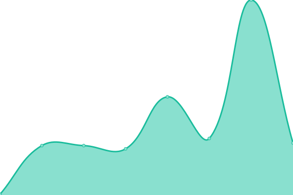
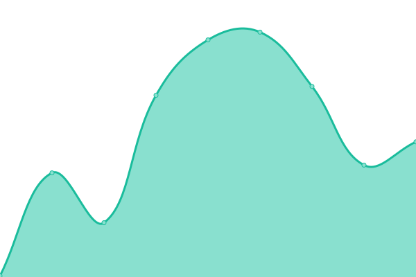

# [📈 Live Status](https://up.kinokonoko.io): <!--live status--> **🟧 Partial outage**

This repository contains the open-source uptime monitor and status page for [Kenny Ha](kinokonoko.io), powered by [Upptime](https://github.com/upptime/upptime).

With [Upptime](https://upptime.js.org), you can get your own unlimited and free uptime monitor and status page, powered entirely by a GitHub repository. We use [Issues](https://github.com/altkennyh2l/upptime/issues) as incident reports, [Actions](https://github.com/altkennyh2l/upptime/actions) as uptime monitors, and [Pages](https://up.kinokonoko.io) for the status page.

<!--start: status pages-->
<!-- This summary is generated by Upptime (https://github.com/upptime/upptime) -->
<!-- Do not edit this manually, your changes will be overwritten -->
<!-- prettier-ignore -->
| URL | Status | History | Response Time | Uptime |
| --- | ------ | ------- | ------------- | ------ |
|  [Google](https://www.google.com) | 🟩 Up | [google.yml](https://github.com/altkennyh2l/upptime/commits/HEAD/history/google.yml) | 

 80ms
     
 | 

<a href="https://up.kinokonoko.io/history/google">100.00%</a>
    

|  [Code-server](https://code.kinokonoko.io) | 🟥 Down | [code-server.yml](https://github.com/altkennyh2l/upptime/commits/HEAD/history/code-server.yml) | 

 225ms
     
 | 

<a href="https://up.kinokonoko.io/history/code-server">0.00%</a>
    

|  [ChihiroSannomiya-Core (Additional)](https://cs-webhook.herokuapp.com/) | 🟩 Up | [chihiro-sannomiya-core-additional.yml](https://github.com/altkennyh2l/upptime/commits/HEAD/history/chihiro-sannomiya-core-additional.yml) | 

 217ms
     
 | 

<a href="https://up.kinokonoko.io/history/chihiro-sannomiya-core-additional">100.00%</a>
    

|  [Minecraft Server Map Service (UmaibouKoubou)](http://mc.komattamode.com:33010/) | 🟩 Up | [minecraft-server-map-service-umaibou-koubou.yml](https://github.com/altkennyh2l/upptime/commits/HEAD/history/minecraft-server-map-service-umaibou-koubou.yml) | 

 309ms
     
 | 

<a href="https://up.kinokonoko.io/history/minecraft-server-map-service-umaibou-koubou">100.00%</a>
    

|  [Minecraft Server (UmaibouKoubou)](mc.komattamode.com) | 🟩 Up | [minecraft-server-umaibou-koubou.yml](https://github.com/altkennyh2l/upptime/commits/HEAD/history/minecraft-server-umaibou-koubou.yml) | 

 132ms
     
 | 

<a href="https://up.kinokonoko.io/history/minecraft-server-umaibou-koubou">100.00%</a>
    

|  [Minecraft Server (Shotanokitou)](mc.komattamode.com) | 🟩 Up | [minecraft-server-shotanokitou.yml](https://github.com/altkennyh2l/upptime/commits/HEAD/history/minecraft-server-shotanokitou.yml) | 

 0ms
     
 | 

<a href="https://up.kinokonoko.io/history/minecraft-server-shotanokitou">100.00%</a>
    

<!--end: status pages-->

[**Visit our status website →**](https://up.kinokonoko.io)

## 📄 License

- Powered by: [Upptime](https://github.com/upptime/upptime)
- Code: [MIT](./LICENSE) © [Kenny Ha](kinokonoko.io)
- Data in the `./history` directory: [Open Database License](https://opendatacommons.org/licenses/odbl/1-0/)
